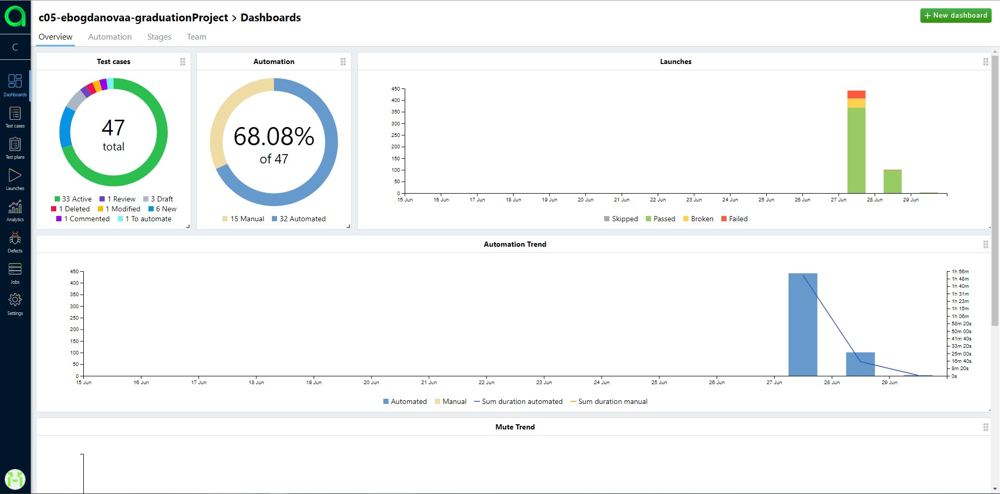
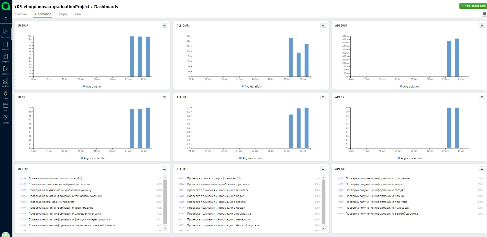
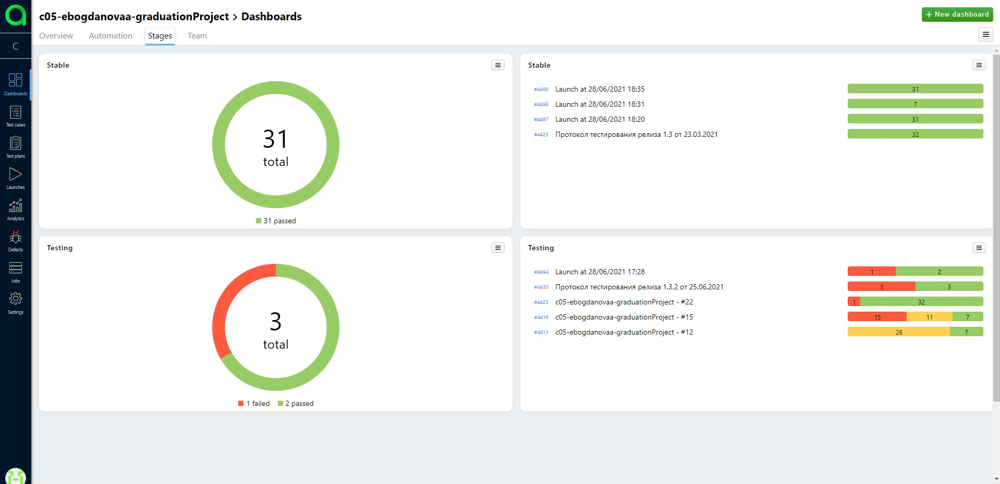
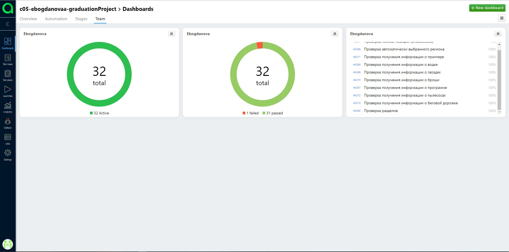
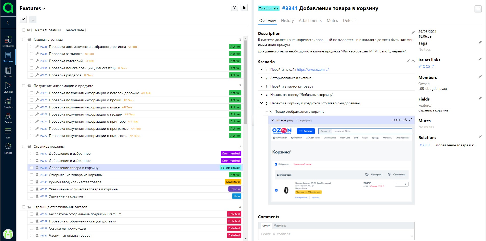
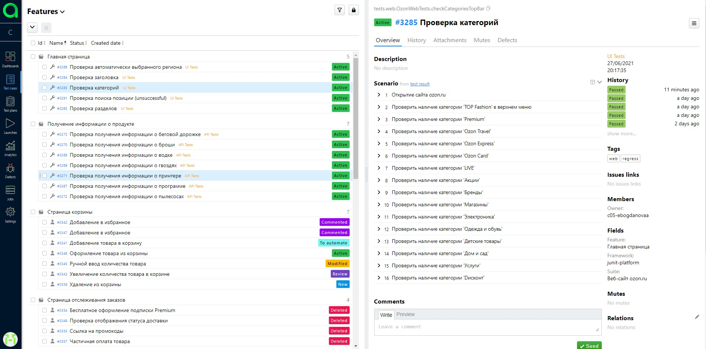
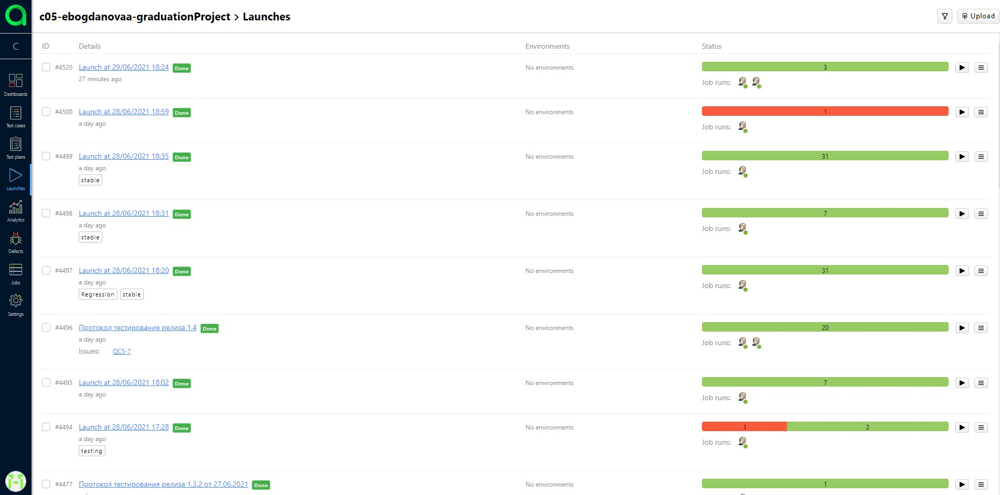
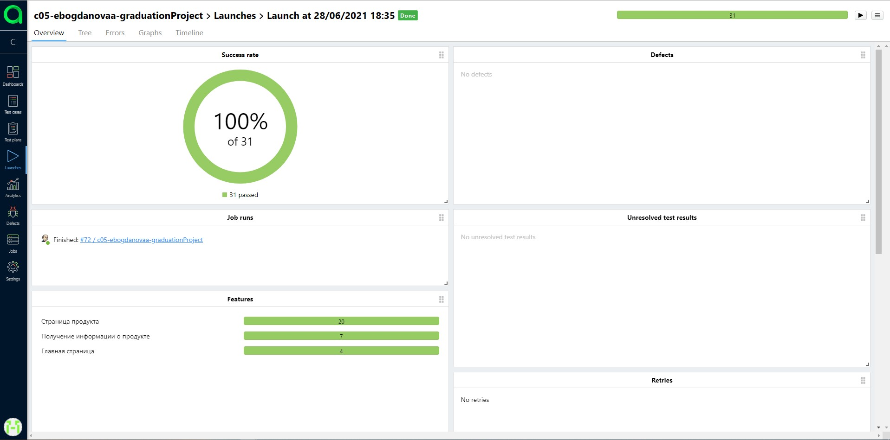

# graduation_project
# Автотесты на http://ozon.ru

<a href="https://www.jetbrains.com/idea/">
    
</a>
<a href="https://www.jetbrains.com/idea/">
    
</a>
<a href="https://www.jetbrains.com/idea/">
    
</a>
<a href="https://www.jetbrains.com/idea/">
    
</a>
<a href="https://www.jetbrains.com/idea/">
    
</a>
<a href="https://www.jetbrains.com/idea/">
    
</a>
<a href="https://www.jetbrains.com/idea/">
    
</a>
<a href="https://www.jetbrains.com/idea/">
    
</a>
<a href="https://www.jetbrains.com/idea/">
    
</a>
<a href="https://www.jetbrains.com/idea/">
    
</a>
<a href="https://www.jetbrains.com/idea/">
    
</a>
<a href="https://www.jetbrains.com/idea/">
    
</a>


IntelliJ IDEA, Java, Gradle, JUnit5, Rest-Assured, Selenide, Jenkins, Selenoid, Github, Allure TestOps, Jira, Telegram (notifications)
____
## Были реализованы следующие проверки:
### UI:

:heavy_check_mark: - Проверка поиска позиции

:heavy_check_mark: - Проверка категорий на главной странице

:heavy_check_mark: - Проверка разделов на главной странице

:heavy_check_mark: - Проверка заголовка на главной странице

:heavy_check_mark: - Проверка автоматически выбранного региона на главной странице

:heavy_check_mark: - Проверка наименования продукта

:heavy_check_mark: - Проверка наличия кнопки 'Добавить в корзину'

:heavy_check_mark: - Проверка наличия ссылки 'Перейти к описанию'

:heavy_check_mark: - Проверка наличия комплектации продукта

:heavy_check_mark: - Проверка наличия описания продукта

:heavy_check_mark: - Проверка наличия информации о бренде продукта

:heavy_check_mark: - Проверка наличия информации о технологии матрицы

:heavy_check_mark: - Проверка наличия информации о коде продукта

:heavy_check_mark: - Проверка наличия информации о функции камеры продукта

:heavy_check_mark: - Проверка наличия информации о разрешении основной камеры

:heavy_check_mark: - Проверка наличия информации об оперативной памяти

:heavy_check_mark: - Проверка наличия информации о весе продукта

:heavy_check_mark: - Проверка наличия информации о разрешении экрана

:heavy_check_mark: - Проверка наличия информации о версии продукта

:heavy_check_mark: - Проверка наличия информации о диогонале

:heavy_check_mark: - Проверка наличия информации о разрешении основной процессоре

:heavy_check_mark: - Проверка наличия информации о гарантии продукта

:heavy_check_mark: - Проверка наличия информации о размере продукта

:heavy_check_mark: - Проверка наличия информации об оперативной памяти

:heavy_check_mark: - Проверка наличия информации об основном материале

### API:

:heavy_check_mark: - Проверка получения информации о водке

:heavy_check_mark: - Проверка получения информации о броши

:heavy_check_mark: - Проверка получения информации о гвоздях

:heavy_check_mark: - Проверка получения информации о принтере

:heavy_check_mark: - Проверка получения информации о программе

:heavy_check_mark: - Проверка получения информации о беговой дорожке

:heavy_check_mark: - Проверка получения информации о пылесосах
____

## Команды для запуска тестов из терминала
Для локального запуска тестов необходимо задать параметры в `local.driver.properies`
```
gradle clean test
```
Для запуска тестов в несколько потоков необходимо в атрибуте `Dthreads` передать число, равное желаемому количеству потоков
```
gradle clean test -Dthreads=3
```
____

## Видео прохождения одного из тестов

____

## В качестве CI системы был использован Jenkins
[Ссылка на джобу в Jenkins](https://jenkins.autotests.cloud/job/c05-ebogdanovaa-graduationProject/)
### Статистика по последним пяти запускам тестов


### Указание параметров для запуска тестов

____

## В качестве системы Тест Менеджмента был использован Allure TestOps
### Основной дашборд для отслеживания



### Дашборд по разным типам тестов



### Дашборд по разным стадиям



### Дашборд по участникам команды



### Пример ручного теста



### Пример автоматизированного теста



### Страница запуска тестов



### Отчет по конкретному запуску


____
## В качестве багтрекера использовалась Jira, у которой была настроена интеграция с Allure TestOps
### Пример инцидента на регресс с привязкой тест-кейсов и запуском тестов


____
## Для отправки нотификаций был выбран Telegram

### Пример нотификации с результатом прохождения тестов


